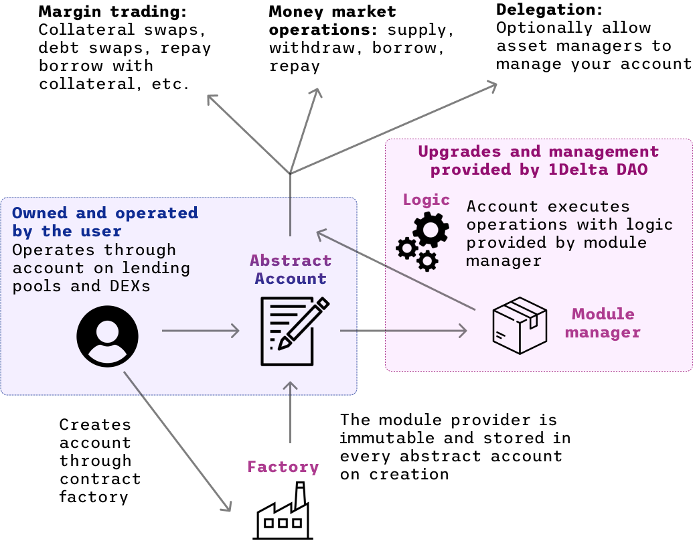

# Architecture Using Abstract Accounts

First of all, users have to create an abstract account using our factory contract. Once the account is created, the user can then interact though it in a very similar manner to the brokerage contract, except that they are rather *self-brokering*.

