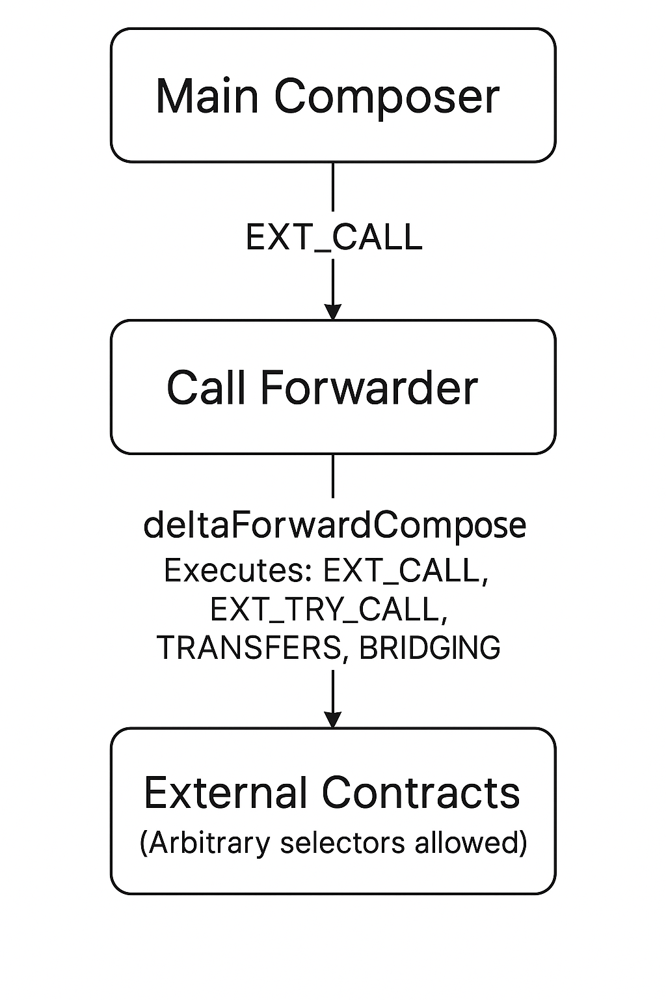

# Call Forwarder Operations

The Call Forwarder (`CallForwarder.sol`) extends the composer's functionality by providing a secure execution environment for complex operations. The main composer first validates calls, then forwards them to the Call Forwarder which can execute external calls.

## Overview

The Call Forwarder supports the following operations:

| Operation                                 | Command ID | Description                               |
| ----------------------------------------- | ---------- | ----------------------------------------- |
| [`EXT_CALL`](#ext-call-operation)         | `0x20`     | External calls with safety checks         |
| [`EXT_TRY_CALL`](#ext-try-call-operation) | `0x21`     | External calls with error handling        |
| [`TRANSFERS`](#transfers-operations)      | `0x40`     | Transfer operations (pull, send, approve) |
| [`BRIDGING`](#bridging-operations)        | `0x90`     | Cross-chain bridge operations             |

## Security Model

The external calls are facilitated by the call forwarder, while this approach seems to be inefficien, it is necessary to prevent malicious callers to execute bad calldata on the `composer` (e.g. trying to execute `transferFrom` from a prior caller that approved the `composer`), also external calls to `permit2` contract are blocked by the composer for the same reason.

## Entry Point

```solidity
function deltaForwardCompose(bytes calldata data) external payable
```

All operations are encoded in the `data` parameter and executed atomically.

## Hierarchical Calling Structure

The system uses a **two-layer architecture** for secure external interactions:

<p align="center">
  
</p>

### Call Architecture Summary

- **Main Composer**
  - Issues `EXT_CALL` operations.
  - Calls the `Call Forwarder` contract via `deltaForwardCompose`.


- **Call Forwarder**
  - Receives and executes forwarded calls.
  - Supports operations:
    - `EXT_CALL` - any smart contract call (`permit2` target is prohibited and so is the `transferFrom` selector)
    - `EXT_TRY_CALL` - any call that will enter a fallback operation in case of an error
    - Token `TRANSFERS`
    - Cross-chain `BRIDGING`
  - Provides controlled execution to avoid exposing the Composer directly to malicious calls.


- **External Contracts**
  - Arbitrary selectors can be targeted.
  - Ensures flexibility while safeguarding Composer from unsafe external interactions.


### Example Structure

```solidity
// Step 1: Encode operations for Call Forwarder
bytes memory callForwarderOperations = abi.encodePacked(
    // Call Forwarder operations here
    uint8(ComposerCommands.TRANSFERS),
    uint8(TransferIds.SWEEP),
    assetAddress,
    receiverAddress,
    uint8(SweepType.AMOUNT),
    uint128(amount)
);

// Step 2: Wrap in EXT_CALL to Call Forwarder
bytes memory composerCall = abi.encodePacked(
    uint8(ComposerCommands.EXT_CALL),
    callForwarderAddress,           // Call Forwarder as target
    uint128(0),                     // No native value needed
    uint16(callForwarderOperations.length),
    callForwarderOperations         // Operations for Call Forwarder
);

// Step 3: Execute on main composer
composer.deltaCompose(composerCall);
```

## EXT_CALL Operation

Execute external calls with built-in safety checks.

### Parameters

| Offset | Length (bytes) | Description         |
| ------ | -------------- | ------------------- |
| 0      | 20             | target `address`    |
| 20     | 16             | value `uint128`     |
| 36     | 2              | dataLength `uint16` |
| 38     | dataLength     | data `bytes`        |

### Notes

-   **`value`** is the native currency amount to attach
-   **`value`** has a high bit flag indicating whether to use `selfbalance()`
-   **Security**: Main composer prevents calls to Permit2 and `transferFrom` selector
-   **Execution**: Reverts on failure with the original error

### Encoding Example

```solidity
bytes memory callForwarderOperations = abi.encodePacked(
    uint8(ComposerCommands.EXT_CALL),  // Operation for Call Forwarder
    targetAddress,
    uint128(nativeValue),
    uint16(callData.length),
    callData
);

bytes memory composerCall = abi.encodePacked(
    uint8(ComposerCommands.EXT_CALL),     // EXT_CALL to Call Forwarder
    callForwarderAddress,                  // Call Forwarder as target
    uint128(0),                           // No native value for Call Forwarder
    uint16(callForwarderOperations.length),
    callForwarderOperations
);
```

## EXT_TRY_CALL Operation

Execute external calls with error handling and fallback options.

### Parameters

| Offset        | Length (bytes)  | Description              |
| ------------- | --------------- | ------------------------ |
| 0             | 20              | target `address`         |
| 20            | 16              | value `uint128`          |
| 36            | 2               | dataLength `uint16`      |
| 38            | dataLength      | data `bytes`             |
| 38+dataLength | 1               | catchHandling `uint8`    |
| 39+dataLength | 2               | catchDataLength `uint16` |
| 41+dataLength | catchDataLength | catchData `bytes`        |

### Notes

-   **`catchHandling`**: Controls error handling behavior
    -   `0`: Revert on failure (default)
    -   `1`: Exit function on failure
    -   `2+`: Continue execution after catch
-   **`catchData`**: Operations to execute if the external call fails

### Encoding Example

```solidity
// With error handling - e.g. sweep tokens back to user on failure
bytes memory catchOperations = abi.encodePacked(
    uint8(ComposerCommands.TRANSFERS),
    uint8(TransferIds.SWEEP),
    address(USDC),           // asset to sweep
    address(user),           // receiver (user who initiated the call)
    uint8(SweepType.VALIDATE), // validate balance before sweeping
    uint128(0)               // amount = 0 means sweep entire balance
);

bytes memory tryCall = abi.encodePacked(
    uint8(ComposerCommands.EXT_TRY_CALL),
    targetAddress,
    uint128(nativeValue),
    uint16(callData.length),
    callData, // the calldata that should be executed
    uint8(1), // catchHandling: exit on failure
    uint16(catchOperations.length),
    catchOperations // the calldata to execute in case of error
);
```

## TRANSFERS Operations

All transfer operations are supported in the Call Forwarder. See the [Transfers documentation](./transfers.md) for detailed information about:

-   **TRANSFER_FROM**: Pull funds from caller
-   **SWEEP**: Send funds from contract
-   **APPROVE**: Approve token spending
-   **UNWRAP_WNATIVE**: Unwrap native tokens
-   **PERMIT2_TRANSFER_FROM**: Permit2 transfers

### Usage in Call Forwarder

```solidity
bytes memory transferOp = abi.encodePacked(
    uint8(ComposerCommands.TRANSFERS),
    uint8(TransferIds.SWEEP),
    assetAddress,
    receiverAddress,
    uint8(SweepType.AMOUNT),
    uint128(amount)
);
```

## BRIDGING Operations

Execute cross-chain bridge operations through supported bridge protocols. See the [detailed bridge documentation](./bridge/bridge.md) for comprehensive information about all supported bridge protocols.

### Basic Parameters

| Offset | Length (bytes) | Description                |
| ------ | -------------- | -------------------------- |
| 0      | 1              | bridgeId `uint8`           |
| 1      | Variable       | bridge-specific parameters |

### Encoding Example

```solidity
bytes memory bridgeOp = abi.encodePacked(
    uint8(ComposerCommands.BRIDGING),
    // Bridge-specific parameters...
);
```

For detailed information about each bridge protocol, including parameter layouts and encoding examples, see:

-   [Bridge Operations Overview](./bridge/bridge.md)
-   [Stargate V2 Bridge](./bridge/stargate.md)
-   [Across Bridge](./bridge/across.md)

## Example: 1inch Meta-Aggregation

Here we illustrate the complete two-layer calling structure for a swap from `USDC` to `WETH` using 1inch.

### Two-Layer Security Flow

```
Main Composer
    ↓ EXT_CALL validation
Call Forwarder
    ↓ deltaForwardCompose validation
    ↓ TRANSFERS (approve) + EXT_CALL (to 1inch) + TRANSFERS (sweep)
External Contracts (Arbitrary selectors allowed)
```

### Complete Process

1. **Main Composer** validates the EXT_CALL (blocks transferFrom/Permit2)
2. **Call Forwarder** receives validated call via `deltaForwardCompose`
3. **Call Forwarder** executes operations with additional security:
    - Approve 1inch router (TRANSFERS with security checks)
    - Call 1inch swap (EXT_CALL with security checks)
    - Sweep received WETH (TRANSFERS with security checks)

```solidity

uint256 swapAmount = 4000.0e6;

// this is the default forwarder address
address callForwarderAddress = 0xfCa1154C643C32638AEe9a43eeE7f377f515c801;

// create the call for the forwarder
// the target can e.g. be the 1inch aggregation router
bytes memory callForwarderCall  = abi.encodePacked(
        uint8(ComposerCommands.EXT_CALL),
        address(oneInchAggregationRouter),
        uint128(0), // ERC20 has no value
        uint16(data.length),
        data
    );

// we need to approve the 1inch router on the callForwarder level
// note that the approval is skipped if it was already done in the past
bytes memory approve1inch = abi.encodePacked(
        uint8(ComposerCommands.TRANSFERS),
        uint8(TransferIds.APPROVE),
        address(USDC),
        address(oneInchAggregationRouter)
    );

// expect to receive 1 WETH
// revert if we receive less
uint256 amountExpected = 1.0e18;

// in case the aggregators does not transfer directly to the user
bytes memory sweepAndCheckSlippage = abi.encodePacked(
        uint8(ComposerCommands.TRANSFERS),
        uint8(TransferIds.SWEEP),
        address(WETH),
        address(receiver), // this is the receiver of the WETH
        uint8(SweepType.AMOUNT),
        amountExpected
    );


// combine the operations
callForwarderCall = abi.encodePacked(
    approve1inch,
    callForwarderCall,
    sweepAndCheckSlippage
);


// prepare the composer call
// this executes callForwader.deltaForwardCompose(callForwarderCall)
bytes memory composerCall  = abi.encodePacked(
        uint8(ComposerCommands.EXT_CALL),
        callForwarderAddress, // it is important to use the forwarder on the composer level
        uint128(value),
        uint16(callForwarderCall.length),
        callForwarderCall
    );

// we need to make sure that teh callForwarder receives the funds directly
bytes memory transferToForwarder = abi.encodePacked(
        uint8(ComposerCommands.TRANSFERS),
        uint8(TransferIds.TRANSFER_FROM),
        address(USDC),
        callForwarderAddress,
        uint128(swapAmount)
    );

// combine the call to the composer
composerCall = abi.encodePacked(
        transferToForwarder,
        composerCall
    );

// execute the operations
composer.deltaCompose(composerCall);

```
