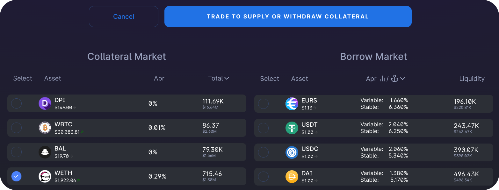
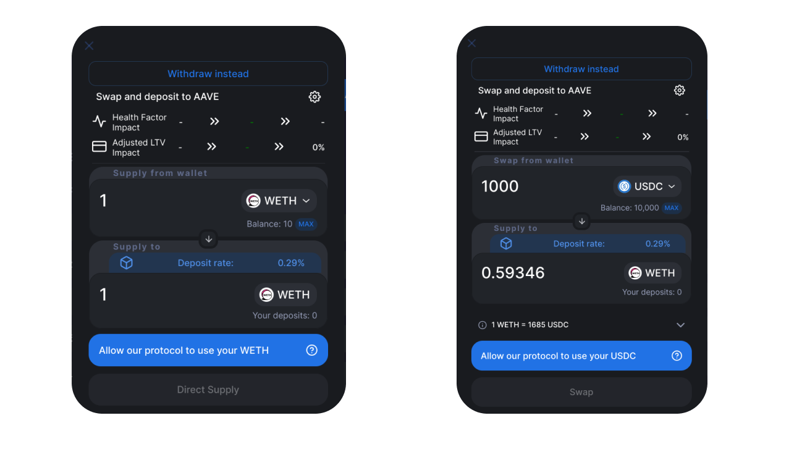
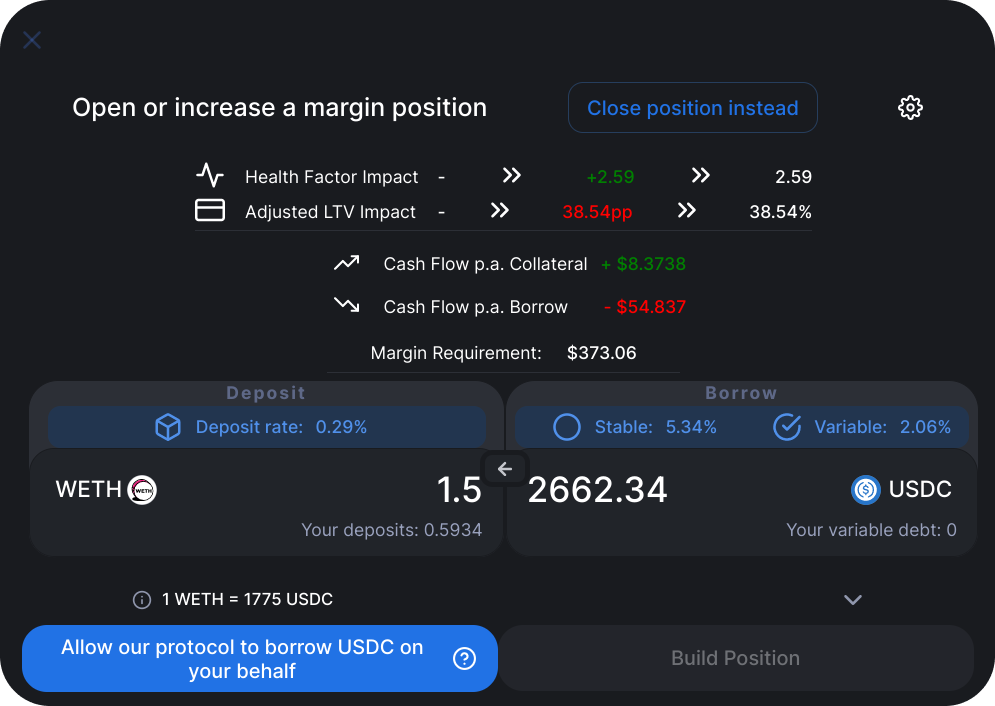
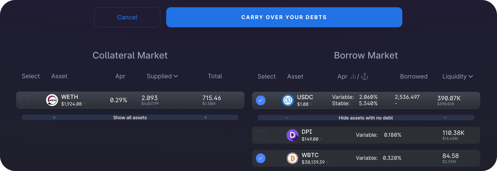
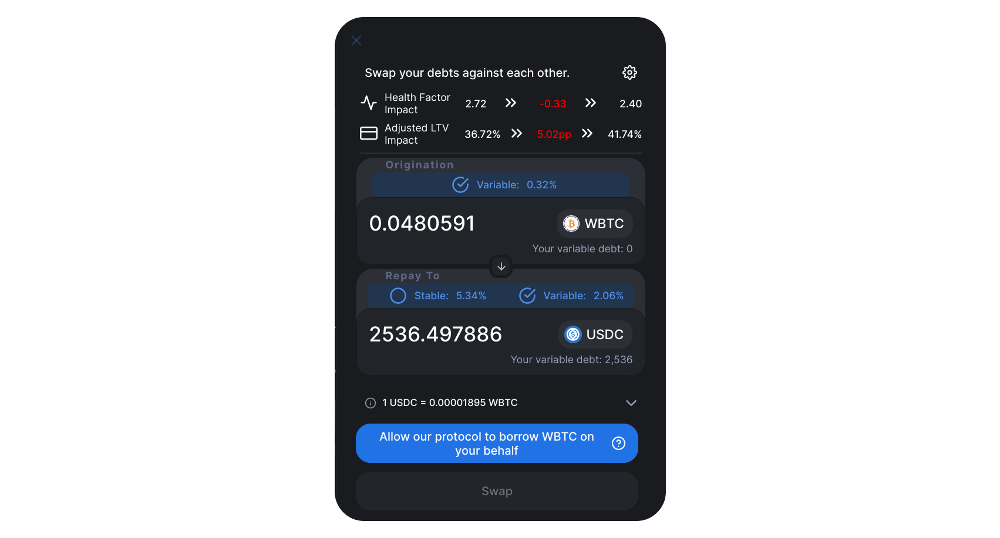
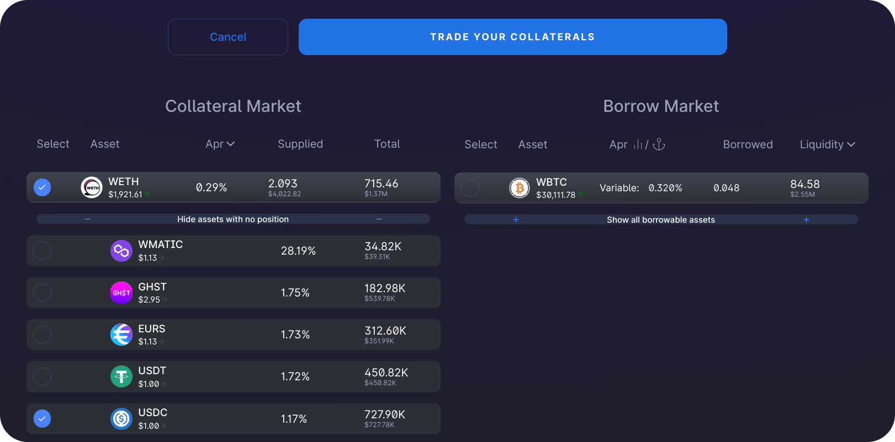
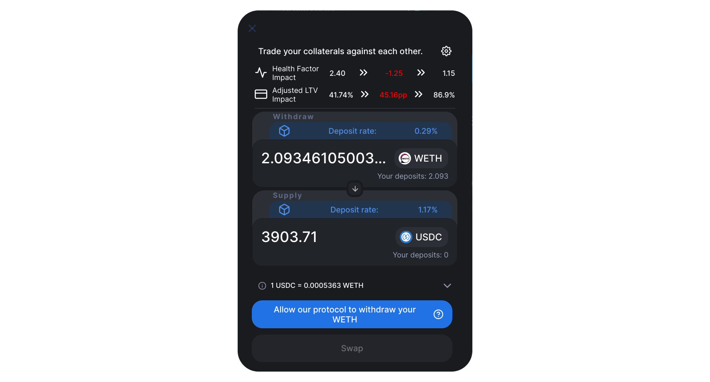

# How to use 1delta's margin aggregator

In this guide, we will outline the process of utilizing the 1delta margin trading implementation to manage lending positions within the Aave lending protocol.

## Supply / Withdraw / Borrow / Repay

To begin, we first select a trade type by clicking the "Start Trading" button, followed by choosing the specific position we wish to engage with.

The screenshot below illustrates a selection of WETH as collateral, indicating that we intend to interact with a WETH collateral position.

 
*Selecting a single asset on the collateral side allows us to either withdraw or deposit to the lender*

By clicking on the prominent blue button, we can now link a swap trade to either a deposit or withdrawal transaction. However, it's essential to deposit collateral first before proceeding with any other transaction types that include borrowing.

 
*On the left hand side, a direct supply is initiated, on the right hand side, a swap from USDC to WETH is done before supplying the obtained WETH*

To initiate a withdrawal, click on "Withdraw instead" or the arrow situated between the input panels.

In order to borrow or repay funds, select a single currency on the debt side. The default mode is set to borrowing; however, by clicking on "Repay instead," we can opt to repay debt using our wallet balance.

## Open a margin position

With collateral in place, we can now proceed to open a margin position by selecting one currency for collateral and another for debt. The example below demonstrates our selection for building a long WETH position funded by borrowing USDC. To execute the trade, click the trade button once more.
 
*Choose a single currency for both collateral and debt sides, then click the trade button to configure the margin trade*

The swap modal presents an overview of the trade details. We can either specify the amount of WETH we wish to deposit or the amount of USDC we want to borrow. First, we must approve the borrow delegation, which grants permission for the 1delta router to borrow funds on our behalf. Additionally, we can choose between different borrowing modes when trading on top of AAVE.

 
*The swap modal displays the trade's impact on our health factor and LTV*

Upon successful execution of the trade, our positions will be displayed:

 
*After execution, our debt position in the selected interest rate mode and an increased WETH position will be visible*

## Swap debt

With 1Delta, we can effortlessly exchange our debt positions in just a single click. To swap our USDC debt for another currency, we simply select USDC and the target currency (in this case, WBTC) to access the debt swap trade configuration.

 
*We initiate the debt swap configuration by choosing two debt currencies*

Within the trade configuration, we approve the borrow delegation (if not already done) to enable borrowing of WBTC. When selecting the maximum amount, 1delta's smart contracts ensure no residual debt remains in the position to be repaid. If the positions are in the wrong order, we can click the arrow between the input panels to switch them.

 
*To switch the currencies in the swap, we can click the down arrow*

Following the trade, we'll notice that the original USDC debt position has been completely replaced with a WBTC debt position.

 
*After executing a debt swap with the maximum repay amount selected, no leftover debt will persist*

## Swap collateral

One of 1delta's key features is the ability to trade collateral without the need to withdraw and repay debt. By selecting two collateral positions, we can easily swap them. In this example, we aim to exchange our WETH collateral for USDC collateral.

 
*We choose two collateral positions to execute a collateral swap*

Upon pressing the trade button, we'll access the configuration. By selecting all available WETH to swap, our entire WETH collateral position will be converted to a USDC collateral position:

 
*The input panel headers indicate which lending protocol interaction occurs for each position - in a collateral swap, the top currency is withdrawn to repay the bottom one*

After approving the withdrawal and executing the transaction, we'll see that our entire collateral position has been exchanged:

 
*Post-execution view of the transaction shown in the previous screenshot*

## Close a margin position

In the event that our health factor drops rapidly, we can prevent liquidation with just a single click. 1delta enables us to directly withdraw, swap, and repay a loan in one simple step. In this case, similar to opening a margin position, we'll need to select one currency on the collateral side (the currency we want to withdraw) and another on the debt side (the currency we want to repay).

Upon clicking the trade button, either click on the arrow or the "Close position instead" button to reduce our position. We'll need to approve the 1Delta contract's withdrawal of collateral on our behalf, as demonstrated in the following screenshot.

 
*Approval of withdrawal is required before closing our position.*

After executing the trade, we'll notice that no debt position remains.

 
*When selecting the maximum amount, no residual debt will persist in the position*

Subsequently, we can withdraw all our collateral as described in the initial step.

## Conclsion

By following the steps outlined in this guide, you have successfully opened an approximately 3x leveraged long position in WETH, switched the exposure to short BTC, and closed the entire position. It's important to note that all actions demonstrated above can be executed in any order and using multiple currencies for both the collateral and debt sides.