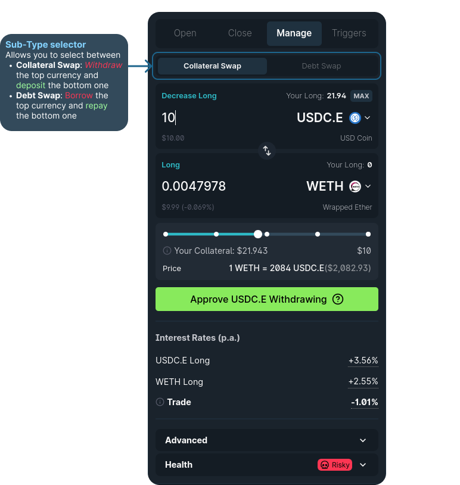

# How to use 1delta's margin aggregator

In this guide, we will outline the process of utilizing the 1delta margin trading implementation to manage lending positions within the AAVE lending protocol.

## Deposit / Withdraw / Borrow / Repay

First-off, we support all basic lending interactions. These can be triggered in multiple ways.
1. Through the main panel (only of you have no deposits)
2. Using the tables undernath the chart with the "My Wallet" or "Markets" tabs

Clicking the button will trigger a quick action panel that allows you to execute any transaction that you could execute with a lending protocol.

  

*The quick action panel allows you to execute all direct transactions with the lenders. The left hand side shows the general view, whereas the right hand side shows a configuration where the trader wants to execute a swap before depositing. On input, the bottom of the panel shows a post-transaction indication.*

The top button row allows you to pick the transactions while the currency dropdowns allow you to pick the currencies for the interaction. In the quick action panel, your wallet balance is always shown at the top, indicated by the wallet icon.

If an additional transaction is required before the transfer, the UI will instruct you to either approve spending (in case of deposits, withdrawals and repayments) or approve borrow delegation.

After execution, you will see your balance in the "positions"-tab in the table:

  

*The amount deposited will be display once the deposit transaction is confirmed.*

## Open a margin position

With collateral in place, we can now proceed to open a margin position by selecting a borrow currency at the top and a the collateral currency at the bottom. You also have to make sure that the "open" option is selected at the top.

In our example, we want to sell the maximum amount MWNT possible given our collateral. This value is auto-selected when clicking on the MAX button. As a collateral, we select the currency that we deposited, USDC. The Account panel on the left hand side allows you to simulate the trade on your position by enabling the "Simulation" switch at the bottom.

  

*On the left hand side, the account panel simulates the user position post-trade. For the given trade on the right hand side, the APR rises by 103 percentage points, the assets and debt rise by about $17.50 and our leverage shoots up to 4.83x.*

A value can be typed into either panel. After entering a value, a trade will be calculated that leads to the best price. The button will be inactive if you are not allowed to execute the trade (e.g. if your selected trade is too large). Otherwise, a click on the button will trigger your wallet to approve the trade.

If any sort of approval is required, the UI will show an approval button instead. Just approve the respective spending or delegation to be able to proceed with the trade.

The balanes in the "Positions" tab swiftly update and we can see the result after executing the trade selected above:

  

*A borrow position with a lender is flagges as a "Short" position in 1delta, whereas collateral positions are "Long" positions.*

## Swap debt or collateral

With 1delta, we can effortlessly exchange our debt or collateral positions in just a single click. The "Swap"-option in the main panel enables a sub-selection with "Collateral" and "Debt" option.
- Collateral: Executing a collateral swap - a transactions where you can withdraw the top currency, swap it to the bottom currency and deposit it directly.
  - An execution requires you to own the withdrawal currency, meaning that you can only execute a trade where the top amount is lower or equal your existing collateral
  - No restrictions apply to the bottom panel 
- Debt: Executing a debt swap - a transaction that borrows the top currency, swaps it to the bottom one and directly repays it.
  - An execution requires you to hold a debt position in the bottom currency.
  - No restriction to the top currency applies

  

*Collateral- and debt swaps allow you to easily change your exposure in a single trade. In this screenshot, we see the 4.57 USDC obtained after a swap from 10 MNT. 

## Closing a margin position

Closing a position (withdraw, swap an repay) is similarly easy. The "Close" tab in top button row allows you to execute the following three interactions in one transaction:
- Withdraw one of your collaterals
- Trade the currency against another one
- Repay an outstanding loan

You can either pick the maximum collateral amount to withdraw or the maximum debt amount to repay. Our implementation makes sure that no borrow dust will be left.

  

*Closing a position allows you to repay a debt position with ease. The simulations on the left hand side shows that our leverage and APR come down to the levels before the position was opened.*