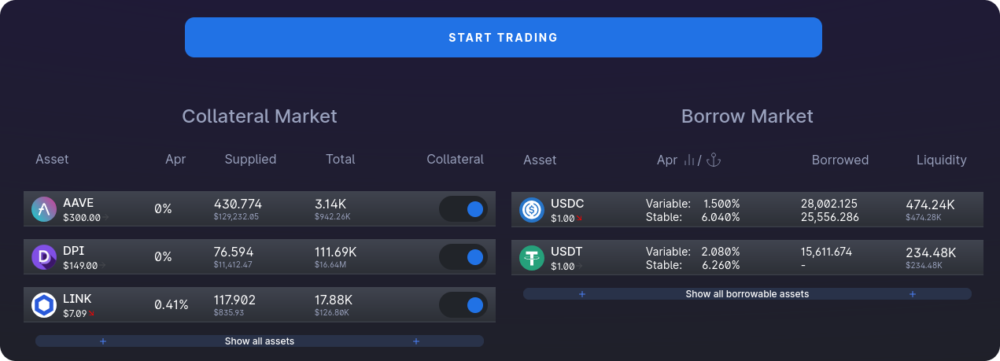
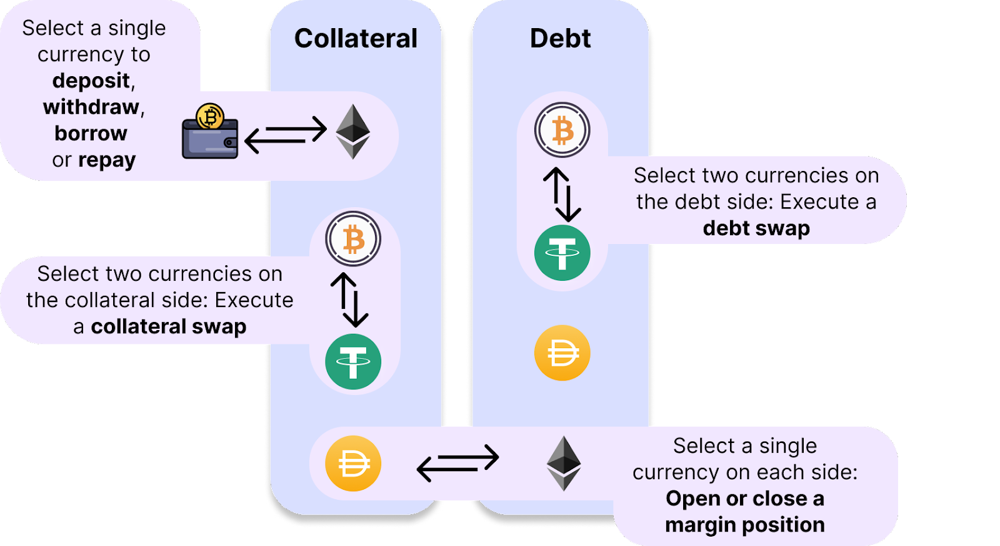

# How To Use 1delta

1delta has a unique approach to margin trading. Our initial version combines the simplicity of a lending protocol interface with well versed swap interfeces that will help you with building any position with the lender.

## Selecting a Trade

To be able to pick positions, you only have to clcik the "Start Trading" button. 

Trades are then selected by clicking on the *checkmarks* next to the token icons. Dependent on your selection, the confirmation button will briefly summarize which type of trade can now be executed.

The selections map to the trade types as follows.
- **Single Collatral Position:** Swap and deposit or wihdraw and swap.
- **Single Debt Position:** Borrow and swap or swap and repay.
- **Two Collatral Positions:** Swap collateral positions.
- **Two Debt Positions:** Swap debt positions.
- **One Collateral and one Debt Positions:** Open a margin position (Borrow, swap and supply) or close one (withdraw collateral, swap and repay debt)

The follwoing chart shows hot the selections compose trade types.

## Lender-Dependent Mechanics

Dependent on which lender you want to trade with, the mechanics can vary

### [With Delegation](delegation.md)
### [Using Abstract Accounts](abstract-accounts.md)
