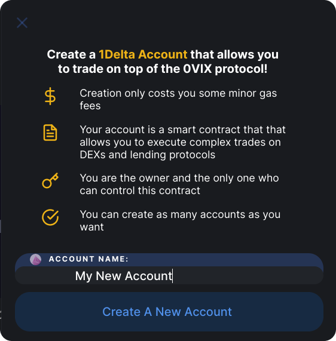
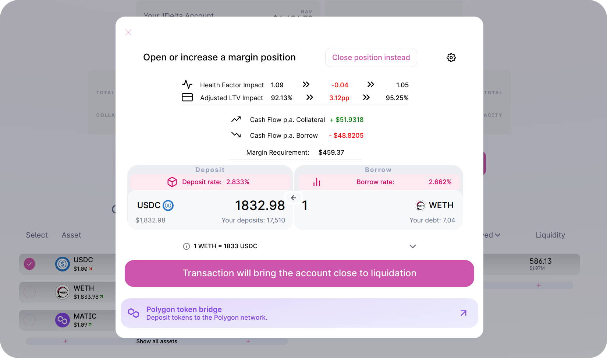
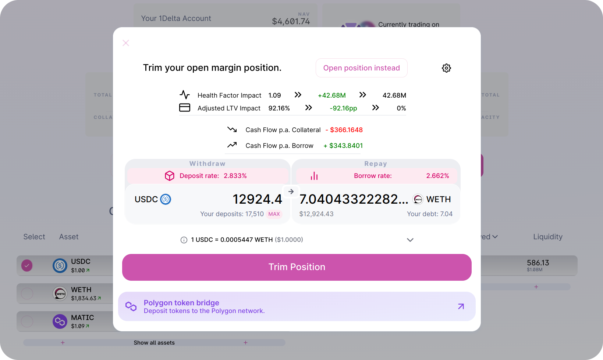

# How to create and use 1delta abstract accounts

## Building a margin position with 1delta

To begin trading, you will need to create a 1Delta account. The account provides you with flexibility, control and is very cheap to create — only minor gas fees are incurred.

Once the account is created, you can deposit funds to the lending protocol. If you do not currently own the token you want to deposit, you can also swap and then supply in the same transaction using a Uniswap-style interface:

It is now time to trade on margin. With your deposited collateral you can now use the full capacity of your borrowing power. The following screenshot shows an indication of a positionn increase where WETH is borrowed and sold for USDC - which is directly deposited. All the relevant risk parameters are shown, in the scenario, the user sees a warning that the account will get close to liquidation after execution.

If our health factor gets very low, the manual withdraw-swap-repay cycle would lead to a significant hassle when trying to unwind the position, all while 1Delta executes the interactions in a single transaction:

*Our health factor is immediately restored if we trim the full position by selecting the maximum output amount on the right hand side. The dApp will also make sure that there is no dust left.*

WE can see that the health factor jumps up and the LTV drops to zero. On top of that, 1delta's implementation prevents dust if you pick the maximum amount for closing a position.