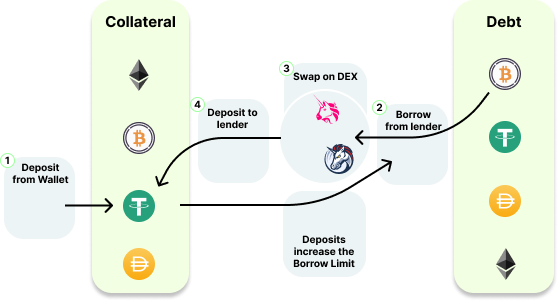

# Margin Aggregation

## Margin Trading In Crypto

Margin trading for cryptocurrencies is a financial strategy that enables investors to trade digital assets like Bitcoin, Ethereum, and other altcoins using borrowed funds from a broker or exchange. This approach allows traders to increase their purchasing power and enhance their profit potential by leveraging their existing capital. However, it's essential to remember that margin trading also entails higher risks and can lead to significant losses if the market moves against the trader's position.

In cryptocurrency margin trading, investors can access leverage, which is essentially a multiplier that amplifies the trader's capital. For example, if a trader uses 5x leverage, a $1,000 investment would provide them with $5,000 worth of purchasing power in the market. This increased exposure can lead to substantial gains if the market moves in their favor, but it can also magnify losses if the market goes against them.

To engage in margin trading, traders are required to deposit an initial margin (or collateral) into a lending protocol. This collateral serves as a guarantee for the borrowed funds and is calculated as a percentage of the total position value. Different lenders may have different margin requirements, and traders should be aware of the specific policies of their chosen platform.

When margin trading cryptocurrencies, it's crucial to understand the concept of liquidation. Liquidation occurs when the market moves against a trader's position to the point where their collateral is no longer sufficient to cover their losses. Lenders usually measure this using the **health factor**.

In such a case, the health factor drops below 1 and the wallet will be flagged for liquidation, allowing another actor to close part of the position to recover the borrowed funds.

In summary, margin trading for cryptocurrencies is a high-risk, high-reward trading strategy that can lead to significant profits or losses, depending on market movements. It's best suited for experienced traders who have a solid understanding of market dynamics and can effectively manage risk.

## Margin Trading In DeFi

To open margin positions, users can manually loop through the following steps if they want to open an ETH-long position with 4x leverage.

1. Supply initial collateral in ETH worth $1,000
2. Borrow $800 worth of USDC (80% of %1,000)
3. Swap to ETH and supply again - This will give us another $640 (80% of $800) in borrowing capacity. We will now repeat this cycle until we obtained our target leverage.
    1. Borrow $640 (80% of $800), swap an supply
    2. Borrow $512 (80% of $640), swap an supply
    3. Borrow $409.6 (80% of $512), swap an supply
    4. Borrow $327.68 (80% of$409.6), swap an supply
    5. Borrow $262.144 (80% of$327.68), swap an supply
    6. Borrow $48.576 (the remaining amount to bring the total borrowed funds to $3,000)

We see that building this leverage takes 22 transactions to complete as each sub-step in step 3. consists of 3 separate transactions. The following chart summarizes the general procedure.

  

*1) A first USDT deposit is required for taking out a loan; 2) we can borrow WBTC to our wallet; 3) we swap WBTC to USDT on a DEX; 4) we deposit USDT to the lender; we repeat from step 2) until we reach the desired position size.*

Certainly, this cannot be the long-term solution to DeFi margin trading. 1delta uses unique methods and implementations that allow opening such positions in a maximum of 2 transactions, where the first one is just the initial supply of the collateral.

## How 1delta Automates The Flow

We illustrate the example above using the 1delta protocol.

1. Supply initial collateral in ETH worth $1,000
2. We use a flash swap and receive $3,000 of ETH and supply
    1. We supply the obtained ETH
    2. We can now borrow 80% of the $4,000 ($3,2000) in USDC the we supplied, we borrow $3,000
    3. We repay the swap pool with the obtained $3,000 in USDC

All sub-steps in step 2. happen within the same transaction. As such, there is no more manual looping when trying to build a leveraged position when using lending protocols. The following chart summarizes the interactions with the lender.

  

*Illustration of a swap router architecture that can open positions (borrow and supply) with flash swaps or flash loans in only two steps. As the 1Delta account is a smart contract, these steps can also be batch-executed in a single transaction.*